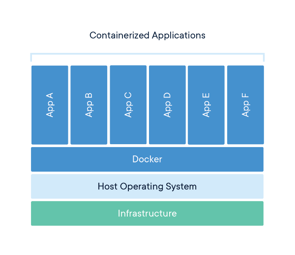

# Dev & prod ready Docker setup for SPA app

### Simple and light env setup to run SPA apps on various configurations with Docker multi-stage build

PS. If you're familiar with Docker and don't need a step by step guide, check only [Multiple compose files](#multi-compose-files), [Configure it](#configure-it) and [Magic of multi-stage build](#magic). Code is available on [GitHub](https://github.com/marcinlesek/docker-spa-setup).

## Table of contents

- [Intro](#intro)
  - [Source vs. Artifact](#source-vs-artifact)
  - [Docker, wtf is that?](#docker)
- [Prepare your own playground](#own-playground)
  - [Setup create-react-app boiler template](#setup-cra)
  - [Install base tools - Docker & docker-compose](#install-tools)
- [Start development environment](#dev-env)
  - [Dockerfile on development env? Oh please no...](#dockerfile-on-dev)
  - [Multiple compose files](#multi-compose-files)
  - [Default environment variables](#default-env-vars)
  - [Rocket launch!](#rocket-launch)
- [Production time](#prod-env)
  - [Configure it](#configure-it)
  - [Magic of multi-stage build](#magic)
  - [Enter the stage!](#enter-stage)
- [Extras](#extras)

## <a name="intro"></a>Intro

Nowadays, frontend applications have a lot of dependencies (everyone knows these funny memes about the size of `node_modules` directory) and ways to be successfully started, deployed and built, so it's not a piece of cake. 
I think everyone started with client apps where we're editing files live on production and probably everything was in one file, or if not, the whole files were available from the client side.
Fortunately, those times is gone, for most of us. :)

### <a name="source-vs-artifact"></a>Source vs. Artifact

Due to optimization, performance etc., actual standards are to parse, minify and combine our production code.
In this article, we will focus on setting up **development** and **production** environment for our app, but this setup will allow you to prepare more environments **in less than 3 minutes**.
So what is the difference between `source` and `artifact` in the SPA application?
Take a look for this simple React app structure:

```
  .
  ├── /build/                     # The folder for compiled production ready output
  ├── /node_modules/              # 3rd-party libraries and utilities
  ├── /src/                       # The source code of the application
  │   ├── /components/            
  │   ├── /routes/                
  │   ├── /styles/                
  │   ├── /...                    
  │   └── ...                     
  ├── /...
  ├── package.json                # Project info like dependencies, authors, scripts etc.                           
  └── ...                          
```

The whole `/src` folder is our app's heart - main code that we're developing. Running applications locally, on development environment by some `webpack-dev-server` or another serving tool, gives us an opportunity to have *hot module reload*, *live preview*, *fast run* etc.
It's really good for development purpose and we'll use it!

### <a name="docker"></a>Docker, wtf is that?

I know, you probably know what is Docker and how it works, but if not, let me show you the short quote from [What is a Container](https://www.docker.com/resources/what-container) which is a great definition of Docker base block.

> A container is a standard unit of software that **packages up code and all its dependencies** so the application runs **quickly and reliably from one computing environment to another**. A Docker container image is a **lightweight, standalone, executable package** of software that includes everything needed to run an application: code, runtime, system tools, system libraries and settings.

I have highlighted key information which will help you understand how it works and how huge benefits it brings to our lives are.
Let's tightly pack our application with all dependencies into a light-weight block called **container** to run it quickly on every environment.

>Available for both Linux and Windows-based applications, the containerized software will **always run the same, regardless of the infrastructure**. Containers **isolate software from its environment and ensure that it works uniformly despite differences for instance** between development and staging.



Always the same result, bypassing the infrastructure.
It is a result of the way Docker works, shown above on architecture scheme.
For more details, check [What is a Container](https://www.docker.com/resources/what-container).

## <a name="own-playground"></a>Prepare your own playground

We'll start with setting up our development environment based on **Docker** & **docker-compose** and `create-react-app` template.
Firstly, we need to set up our basic app. Of course in the bigger project, we'll have many more dependencies, services and complexity but the problem solution is almost the same.

### <a name="setup-cra"></a>Setup create-react-app boiler template

Create our boiler template app:

```bash
$ npx create-react-app my-app
```

After that, we should see a message like this:

```bash
Success! Created my-app at /path/to/my-app
```

Now, let's run our hello world application:
```bash
$ cd my-app
$ yarn start
```

After a few seconds, we should see information regarding successfully compiled and served under `localhost:3000`, with all things we need to easily develop an app.
Great! 

### <a name="install-tools"></a>Install base tools - Docker & docker-compose

Now the real fun begins.
Next things that we'll need will be `docker` and `docker-compose`.
This tutorial was written using:

```bash
$ docker -v
Docker version 18.06.0-ce, build 0ffa825
$ docker-compose -v
docker-compose version 1.21.0, build 5920eb0
```

If you don't have `docker` or `docker-compose` on your local machine, check [Docker installation guide](https://docs.docker.com/install/) or [docker-compose installation guide](https://docs.docker.com/compose/install/).
Due to these versions, we could use **compose files** over `3.6` version.
Now, in project root directory let's create a directory called `.docker` where we'll keep the whole Docker configuration.

```bash
$ mkdir .docker
$ cd .docker
```

## <a name="dev-env"></a>Start development environment

Okay, we've set up our own local machine, so we have all the tools we need to start our journey.
If you know Docker a bit, your first association may be **Dockerfile**!
Of course, you're right, but let me explain about it a bit more... 

### <a name="dockerfile-on-dev"></a>Dockerfile on development env? Oh please no...


Some of you will probably not agree with me, but I will try to convince you, that **using Dockerfile on development environment isn't the best way** you could choose (if not necessary, of course) - sometimes it's a must have, but let's say it officially: in most cases, **it's not**.

Dockerfile allows us to create a custom Docker image for our container from an existing one and add our changes to the build process.
It's great, even we'll be using it here in next chapters, but **in production setup**, where *optimization, security and light-weight* of the app is **crucial**. 

On the other hand, we have **docker-compose**, which could manage services (containers) with `docker-compose.yml` file.
I would even say that it helps us to simplify the definition of our services by defining all containers in one file.
Additionally, it allows us to set ports, image to use, volumes, environments variables and many more! After two years with Docker in commercial products, I could say, for basic or mid-advanced projects, we could handle it with only [docker-compose](https://docs.docker.com/compose/).
Benefits?
**Less time under building application** (mostly crucial for frontend developers working with watchers and hot reloads) because we'll be reducing our build time without any of our custom commands for build own image.

Be lighter and flexible, especially on the development environment, when you need this a lot with continuous changes you're making.

### <a name="multi-compose-files"></a>Multiple compose files

Firstly, what is `multiple compose files`?
By default, our docker-compose will read base `docker-compose.yml` file which according to the convention, it should be our base configuration, which **will be shared over all environments**.
After that, compose will append the final docker-compose file with override file like `docker-compose.override.yml`.
When some services are defined in both, they will be merged together.
This feature is really cool and will help us to keep our setup clear and easy to maintain.

So, we'll create `docker-compose.yml` which will be our base for all environments, also production etc. 

```yml
# docker-compose.yml
version: '3.6'

services:
  client:
    env_file:
      - .env
```

So, what happened here? Probably you know `docker-compose` schema and properties, but if not, I will explain a little:

* `version: 3.6` - Shows supported compose file version to `docker-compose`, so we'll know what syntax and features we could use.
* `services:` - main compose purpose, registering services to run them all neither using a command for one by one like `docker run ...`
* `client:` - registering our first and main service - `client` which will be our React app,
* `env_file:` - pointing the `.env` file which should be used to get global environments values for our setup. This file helps us to storage variables for our app like exposed port, application environment, compose project name and much more, that we could easily change due to fact that they are in one place.

Okay, now our **Docker** setup contains only base `docker-compose.yml`, so we need to add first override compose file for development environment: `docker-compose.dev.yml`

```yml
# docker-compose.dev.yml
version: '3.6'

services:
  client:
    image: node:carbon
    volumes:
      - ..:/opt/app:cached
    ports:
      - "${NODE_PORT}:${NODE_PORT}"
    working_dir: /opt/app
    command: "/bin/sh -c 'yarn install --frozen-lockfile --production=false; yarn start'"
```

Describe a bit more this little magic:

* `image:` - here we're specifying that we want to use an image with predefined `node.js` in `carbon` (`8.x`) version. Based on this image, Docker will build a container for our application (`client`),
* `volumes:` - this allows us to mount some data volume (we don't need to copy, because we mount data from our host to container) as `HOST:CONTAINER` path. So we're mounting `..` from the host (project root directory) to `/opt/app` in our container. We also add `:cached` to improve Mac's performance. More details about it [here](https://docs.docker.com/docker-for-mac/osxfs-caching/#cached).
* `ports:` - here we assign port from our host to port in our container (`HOST:CONTAINER`), so we could access our container from outside e.g. `5000:5000` maps port `5000` from host to port `5000` in the container. We could also parametrize these values so we're getting them from env variables,
* `working_dir:` - specifies root app directory, where `docker-compose` will be working,
* `command:` - command which will run our container. We're passing to shell our commands (via `/bin/sh -c`), which firstly installs dependencies with frozen lockfile (don't generate new `yarn.lockfile` and download the same versions) and forces production flag to false (be sure, that `devDependencies` also will be installed).

### <a name="default-env-vars"></a>Default environment variables

For now, our Docker setup won't do anything useful for us.
Also, if you'll try now to run it, compose will warn you about lack of image or build source.
Firstly, let's add `.env` template file called `.env.dev.dist`!

```apacheconf
# .env.dev.dist
COMPOSE_PROJECT_NAME=my-app-spa
COMPOSE_FILE=docker-compose.yml:docker-compose.dev.yml
NODE_ENV=development
NODE_PORT=3000
```

We added few environment variables:

* `COMPOSE_PROJECT_NAME` - set our project name, it will be used as a prefix for creating our services containers later, so it should be short and intuitive,
* `COMPOSE_FILE` - this one is due to the fact, that we want to use multiple compose files. We specify which files should be overridden and by which one. By this variable, we could setup it per application environment, but about this will be later. Syntax looks like: `base:override1:override2` etc.,
* `NODE_ENV` will be used in our app to specify in which environment we're now, like development or production,
* `NODE_PORT` to easily change the exposed port from our service container, now we set it as default `3000`,

Our template is ready, we need to copy it to *proper* `.env` file:

```bash
$ cp .env.dev.dist .env
```

### <a name="rocket-launch"></a>Rocket launch!

Yeah! Now with this `docker-compose.dev.yml` and the `.env` file we're able to start our app in Docker:

```bash
$ docker-compose up -d
Starting my-app-spa_client_1 ... done
```

**Congratulations**! You **set up your development** environment.

## <a name="prod-env"></a>Production time

Now we can assume that few sprints of development have passed and you have your dream *MVP ready to production*. But only development environment is working now - it's heavy, not optimized and with a lot of unneeded logs.
Let's change it!

### <a name="configure-it"></a>Configure it

Early on, we should add new `docker-compose` override for your production build, let's call it `docker-compose.prod.yml`:

```yml
# docker-compose.prod.yml
version: '3.6'

services:
  client:
    build:
      context: ../
      dockerfile: .docker/Dockerfile
    ports:
      - ${NGINX_PORT}:80
    restart: unless-stopped
```
As you can see, it's changed a lot from `dev` version, so nothing could be passed up to our base `docker-compose.yml` file.
Now we'll be using the build process rather than a ready-made image from Docker Hub and [nginx](http://nginx.org/) to serve our app.
Of course, you could also use [Apache](https://httpd.apache.org/) or another HTTP server.
Our service is called `client`, just as in `dev` setup, because we're building this same app in another configuration, we won't break our network connection (for example [using service name rather than IPs](https://docs.docker.com/docker-cloud/apps/service-links/#using-service-and-container-names-as-hostnames)).
Let's take a closer look at it:

* `build:` - here we're specifying our build process, how we would create our image for our production containers,
  * `context:` - we're passing, that context for your build is the root application directory (information for Docker daemon), so we're going one level up. By default, Docker will be looking for Dockerfile here, but we'll specify it below.
  * `dockerfile:` - direct path to your Dockerfile,
* `ports` - same as above, but now with another environment variable `NGINX_PORT` which we'll set up later,
* `restart:` - container restart policy. We don't want our production to be down for a long time due to some mistakes or not to start after server restart - `unless-stopped` will cover it for us, containers will be restarted always, except for the moment when we'll stop them manually (e.g. `docker-compose stop`). I don't recommend it on our dev machines, because it'll start always with our operating system and sometimes you don't want to code, so free up your resources.

This basic `docker-compose.prod.yml` **won't handle everything, but it's really good to start for production setup** (or good skeleton for it).
For example, here we didn't handle HTTPS connection on 443 port (but it's easy to add, don't worry #trueStory).

Now let's build our `.env` file for production.
But wait, we already have a file named `.env` - and **it's wrong**!
For many reasons, as an example security, you shouldn't keep `.env` files in the repository.
It's really easy to change them between deploys without changing any code and also it's very often to store in them some keys that couldn't be public.
They should show us what it's necessary for the application to work on a particular environment, but it should be completed manually (**especially for private keys!**).
To be sure we didn't do it, we'll add a record to `.gitginore`:

```yml
# .gitignore
...

# docker
.docker/.env
```

Now let's rename our `.env` to `.env.dev.dist` where we'll store our development variables setup and let's create `.env.prod.dist` for production.
With this move, whenever you'll be changing the environment or setting it for the first time, you will have to do `cp .env.{ENV}.dist .env` correctly.
Nothing special, but this must be kept in mind.

```apacheconf
# .env.prod.dist
COMPOSE_PROJECT_NAME=my-app-spa
COMPOSE_FILE=docker-compose.yml:docker-compose.prod.yml
NODE_ENV=production
NGINX_PORT=80
```

We've three differences between our `.env.dev.dist` file, let's describe them:

* we changed our override `docker-compose` file for `prod` version,
* `NODE_ENV` is set for `production`, it's necessary, because many JavaScript engines, frameworks and libraries check this variable and optimize themselves according to its value,
* `NGINX_PORT` - new variable instead of `NODE_PORT`, used to specify on which port we want had our production app served from the container by **nginx**.

Nothing hard, isn't it?

### <a name="magic"></a>Magic of multi-stage build

This is the moment everyone was waiting for - we can create `Dockerfile` with [mutli stage build](https://docs.docker.com/develop/develop-images/multistage-build/)!

```Dockerfile
# Dockerfile
# Stage 1 - the build process
FROM node:carbon-alpine as builder
RUN mkdir /opt/app
WORKDIR /opt/app
COPY . ./
RUN yarn; yarn build

# Stage 2 - the production environment
FROM nginx:alpine

COPY .docker/nginx/default.conf /etc/nginx/conf.d/
RUN rm -rf /usr/share/nginx/html/*
COPY --from=builder /opt/app/build /usr/share/nginx/html

CMD ["nginx", "-g", "daemon off;"]
```

Wow, what happened here?
Let's look on **first stage**, where we'll **build** our app. 

1. Firstly, we pull `node:carbon-alpine` image (alpine is a lightweight image without any not necessary tools) and name it `builder` in our Dockerfile space.
2. In the second line, we're creating directory `/opt/app` where we'll have our root project directory.
3. Tell Docker, that this folder (`/opt/app`) in a container is root, where we'll be executing everything later (with this we don't have to use absolute paths).
4. Now we're copying the whole project here.
5. Run dependency install and production build to create our app. Of course, you could also use npm: `npm i; npm run build`.

Probably you're thinking now - okay, we had our container, our app is built, why not add the second service as HTTP server in `docker-compose.prod.yml` file and serve this app?
Here is a place, **where multi-stage build enters**!
Of course, you're right, but in this container, you'd the whole app source, dependencies (`node_modules` bigger than the sun) and nothing to serve it (right now).
The multi-stage could make it thinner, with nginx and only with one service!
Sounds cool?
Let's check what is going on in the second build stage.

6. Now, let's pull `nginx:alpine` image (lightweight HTTP server) which will be serving our app (and in future could be also reverse proxy, load balancer etc.).
7. After that, we need to set it up. Luckily, it could be only copying default configuration prepared earlier (it will be displayed below, due to fact configuring nginx could be placed for another series of posts, we'll leave it for now).
8. Remove everything from default nginx serve directory (be sure we have clean space for our application).
9. **Magic is here!** Now we're copying only our build output from `builder` container (our `node` image where the application was built) to our new container with nginx to default serve location. After this move, Docker **will automatically remove old, not used builder container** and we'll have `nginx:alpine` container with **only built application files** as `client` service. **Amazing**!
10. A command which will be used to run container, here we're starting nginx with flag `daemon off` so he will be run in the background and serve our application.

Almost done!

### <a name="enter-stage"></a>Enter the stage!

The last thing to do, create space for nginx related properties/files (it's a good way to store files & configurations with their purpose, also it's easier to manage it in bigger projects):

```bash
$ mkdir .docker/nginx
```

And create `default.conf` file to set up our server:

```apacheconf
# default.conf
server {
  listen 80;

  sendfile on;
  default_type application/octet-stream;

  server_name your-site.com;

  gzip on;
  gzip_http_version 1.1;
  gzip_disable      "MSIE [1-6]\.";
  gzip_min_length   256;
  gzip_vary         on;
  gzip_proxied      expired no-cache no-store private auth;
  gzip_types        text/plain text/css application/json application/javascript application/x-javascript text/xml application/xml application/xml+rss text/javascript;
  gzip_comp_level   9;

  root /usr/share/nginx/html;

  location / {
    try_files $uri $uri/ /index.html =404;
  }
}
```

This setup handles the only HTTP and serves our `index.html`.
You only need to change `server_name` property value to your own url address.
After that, you only have to run it:

```bash
$ docker-compose up -d
```

You'll see Docker output regarding building our application with whole steps:

```bash
$ docker-compose up -d
Building client
Step 1/10 : FROM node:carbon-alpine as builder
 ---> df48b68da02a
Step 2/10 : RUN mkdir /opt/app

...

Successfully built 0977583c3825
Successfully tagged my-app-spa_client:latest
Starting my-app-spa_client_1 ... done
```
Now, you could check your site locally entering `localhost:{NGINX_PORT}` and officially say **hello my production app**! Whoooa!

## <a name="extras"></a>Extras

I hope this post will help you to understand how **multi-stage build** works and how you could use it to improve your SPA app (not that it won't work perfectly well for API too, but it's probably a topic for another post probably).
You could find a working code on my [GitHub](https://github.com/marcinlesek/docker-spa-setup), so don't hesitate to check it if you'll force some troubles with this guide or ask me some questions here or on my [Twitter](https://twitter.com/marcinlesek), I will try to help you. :)

I also leave here some helpful links (some basics and some advanced a bit, used to create this article and also mentioned above), but to be honest, the best way to learn Docker, is diggin' into it and checking their documentation, which is so great!

* [What is a Container](https://www.docker.com/resources/what-container),
* [Get started with Docker](https://docs.docker.com/get-started/),
* [Get started with Docker Compose](https://docs.docker.com/compose/gettingstarted/),
* [Multi stage build](https://docs.docker.com/develop/develop-images/multistage-build/),
* [Multiple Compose files](https://docs.docker.com/compose/extends/#multiple-compose-files)

Good luck!
